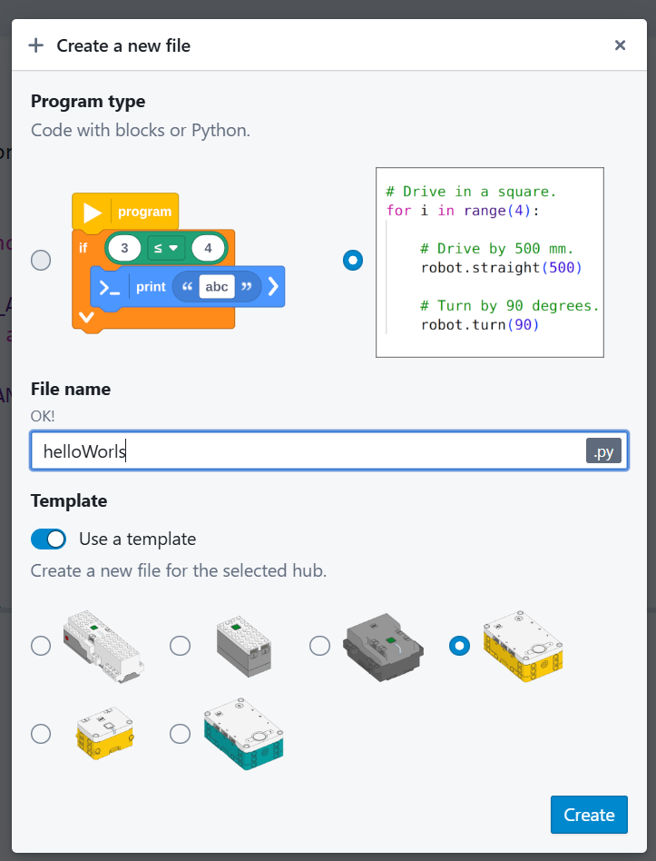

# Создание кода

Перед тем как писать код, нужно создать новый файл в редакторе Pybricks.

## 1. Создание файла
1. Откройте [code.pybricks.com](https://code.pybricks.com/).
2. Нажмите на кнопку **"+"** (New file) в левом верхнем углу.
3. Выберите Python (Блочное программирование платное).
4. Введите имя файла, например `helloWorld`.

??? note "Скриншоты"
    { width = 100 }
    { width = 100 }

## 2. Интерфейс редактора
* **Центральная область**: Здесь вы пишете код.
* **Левая панель**: Файловый менеджер и инструменты (Bluetooth, настройки).
* **Нижняя панель**: Консоль вывода (print) и ошибки.
* **Кнопка Play (синяя)**: Загрузить и запустить программу.
* **Кнопка Stop (красная)**: Остановить выполнение.

## 3. Сохранение
Код сохраняется автоматически в браузере. Однако рекомендуется регулярно скачивать файлы на компьютер (кнопка "Export" или "Save"), чтобы не потерять их при очистке кэша браузера.
