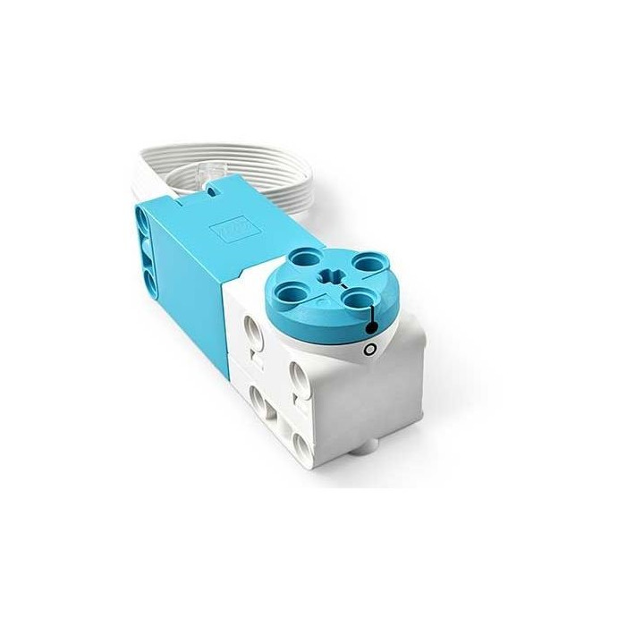
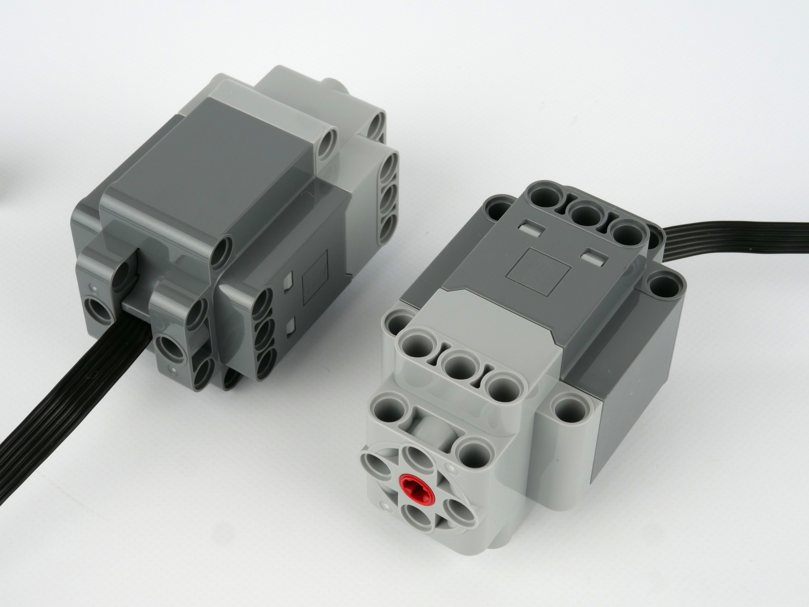

# Управление моторами

## Моторы SPIKE Prime и Powered UP

| Мотор | Система | Фото | Скорость (RPM) | Крутящий момент (N·cm) |
|------|---------|------|---------------|-----------------------|
| **Technic Large Angular Motor (45602)** | SPIKE Prime |  | 175 без нагрузки / 135 при максимальной эффективности | 8 при максимальной эффективности / 25 в стопоре |
| **Technic Medium Angular Motor (45603)** | SPIKE Prime |  | 185 без нагрузки / 135 при максимальной эффективности | 3.5 при максимальной эффективности / 18 в стопоре |
| **Technic Large Motor (88013)** | Powered UP |  | ≈198 | ≈8.8 |
| **Technic XL Motor (88014)** | Powered UP |  | ≈198 | ≈8.8 |
| **Medium Angular Motor (88018)** | Powered UP |  | ≈198 | ≈8.8 |
| **Medium Linear Motor (88008)** | Powered UP |  | ≈270 | ≈4.1 |