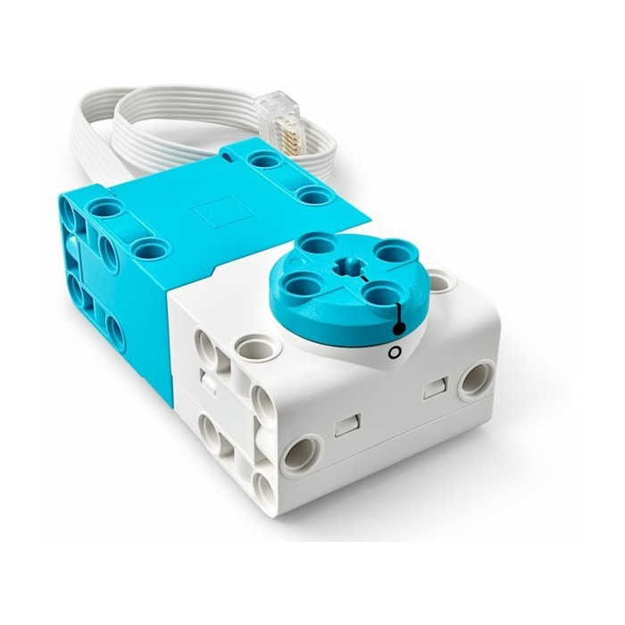
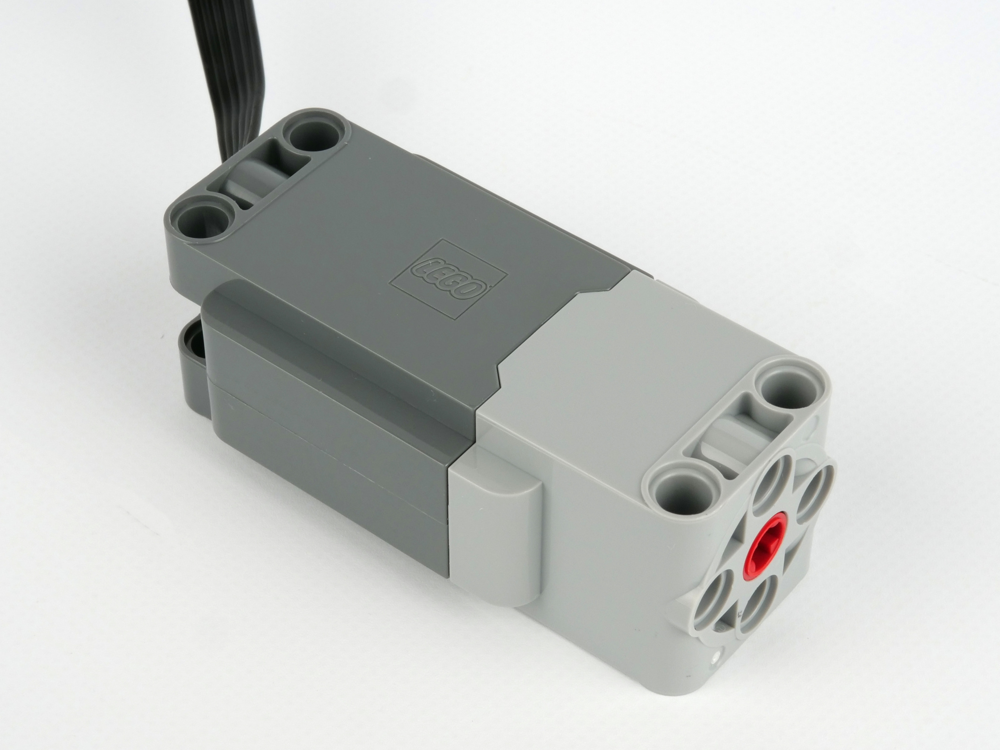
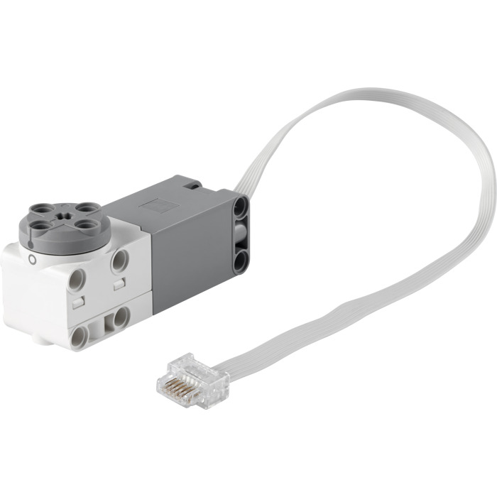
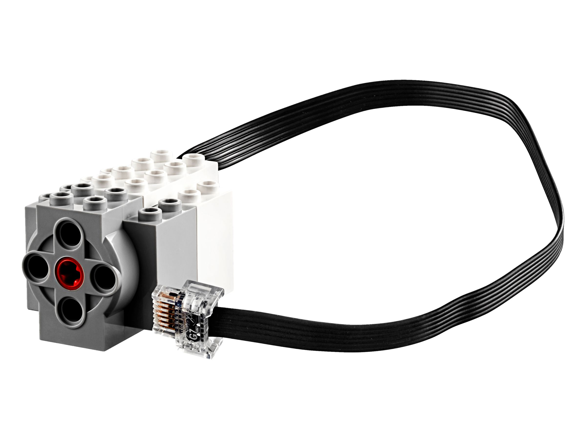

# Управление моторами

## Моторы SPIKE Prime и Powered UP

<table style="width:100%; table-layout:fixed; border-collapse:collapse;">
  <thead>
    <tr>
      <th style="width:32%; text-align:left;">Мотор</th>
      <th style="width:14%; text-align:left;">Система</th>
      <th style="width:10%;">Фото</th>
      <th style="width:22%; text-align:left;">Скорость (RPM)</th>
      <th style="width:22%; text-align:left;">Крутящий момент (N·cm)</th>
    </tr>
  </thead>
  <tbody>
    <tr>
      <td><b>Technic Large Angular Motor (45602)</b></td>
      <td>SPIKE Prime</td>
      <td>
        
      </td>
      <td>
        175 (без нагрузки) 
        135 (макс. эффективность)
      </td>
      <td>
        8 (эффективность) 
        25 (стопор)
      </td>
    </tr>
    <tr>
      <td><b>Technic Medium Angular Motor (45603)</b></td>
      <td>SPIKE Prime</td>
      <td>
        
      </td>
      <td>
        185 (без нагрузки) 
        135 (макс. эффективность)
      </td>
      <td>
        3.5 (эффективность) 
        18 (стопор)
      </td>
    </tr>
    <tr>
      <td><b>Technic Large Motor (88013)</b></td>
      <td>Powered UP</td>
      <td>
        
      </td>
      <td>≈198</td>
      <td>≈8.8</td>
    </tr>
    <tr>
      <td><b>Technic XL Motor (88014)</b></td>
      <td>Powered UP</td>
      <td>
        
      </td>
      <td>≈198</td>
      <td>≈8.8</td>
    </tr>
    <tr>
      <td><b>Medium Angular Motor (88018)</b></td>
      <td>Powered UP</td>
      <td>
        
      </td>
      <td>≈198</td>
      <td>≈8.8</td>
    </tr>
    <tr>
      <td><b>Medium Linear Motor (88008)</b></td>
      <td>Powered UP</td>
      <td>
        
      </td>
      <td>≈270</td>
      <td>≈4.1</td>
    </tr>
  </tbody>
</table>
