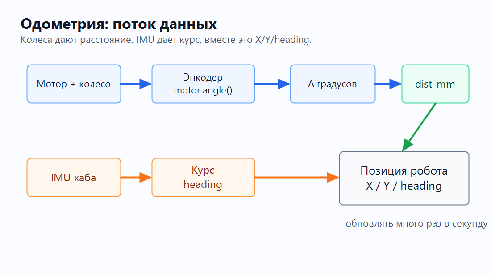
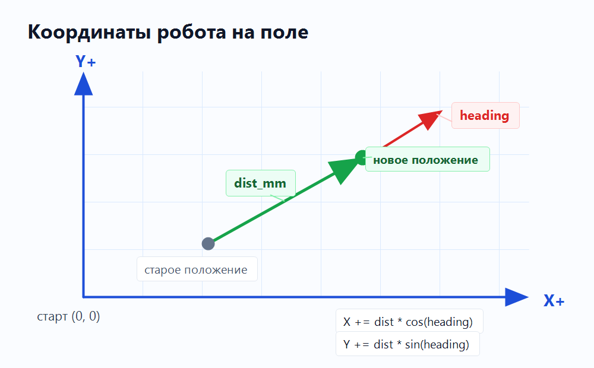
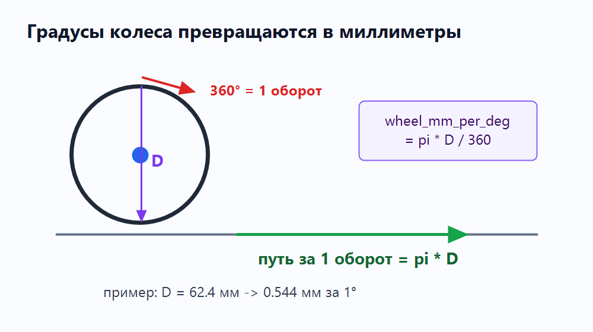
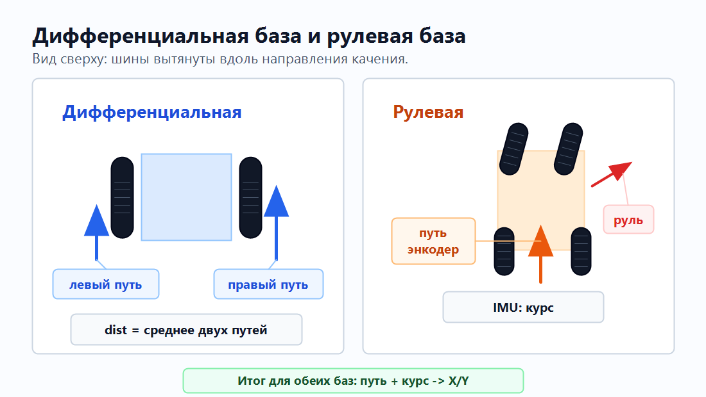
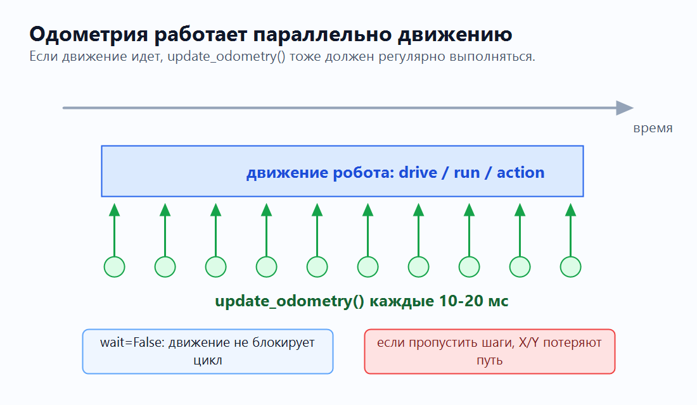

# Одометрия

Одометрия - это способ отвечать на простой вопрос: **где сейчас робот?**

Робот не видит поле сверху. Он только читает свои датчики и постепенно ведет
внутреннюю запись:

```text
X = где робот по горизонтали, мм
Y = где робот по вертикали, мм
heading = куда робот смотрит, градусы
```

Если совсем просто: одометрия - это **дневник маленьких перемещений**. Робот не
знает свою позицию магически. Он много раз подряд записывает: "я проехал еще
чуть-чуть вот в этом направлении".

Самая простая цепочка выглядит так: мотор дает вращение, энкодер дает градусы,
колесо переводит градусы в миллиметры, IMU дает курс, а программа обновляет
`X/Y/heading`.

Та же идея как поток данных:



Идея не в том, что робот один раз "узнал координаты". Идея в том, что программа
много раз в секунду делает маленькое обновление:

1. Сколько повернулись колеса?
2. Сколько миллиметров проехал центр робота?
3. Куда робот был повернут в этот момент?
4. На сколько изменить `X` и `Y`?

## Карта сверху

Для статьи договоримся о такой простой системе координат:



Это учебная схема. На реальном роботе главное не название осей, а постоянная
договоренность: где ноль, куда растет `X`, куда растет `Y`, и какой знак у
поворота.

## Что измеряем

| Часть | Что читаем | Единицы | Зачем |
| :--- | :--- | :--- | :--- |
| Мотор | `motor.angle()` | градусы | Узнать, насколько повернулось колесо. |
| Колесо | диаметр `D` | мм | Перевести градусы колеса в путь по полу. |
| Дифференциальная база | левый и правый путь | мм | Оценить путь центра робота по двум ведущим колесам. |
| Рулевая база | путь ведущего колеса/колес | мм | Оценить, сколько проехал робот с рулевым управлением. |
| IMU | `hub.imu.heading()` | градусы | Узнать, куда робот смотрит. |
| Одометрия | `X`, `Y`, `heading` | мм и градусы | Хранить текущую позицию робота. |

## 1. Мотор

Мотор вращает колесо. Но команда мотора сама по себе не говорит, где робот.

```python
left_motor.dc(40)
right_motor.dc(40)
```

Этот код означает только "крути моторы". Робот может поехать вперед, может
проскользнуть, может упереться в стену. Для одометрии нам нужны не команды, а
измерения.

## 2. Энкодер

В Powered Up / SPIKE моторах есть датчик вращения. В Pybricks он читается так:

```python
left_angle = left_motor.angle()
right_angle = right_motor.angle()
```

`angle()` возвращает накопленный угол мотора в градусах.

Энкодер можно представить как счетчик на колесе: он не говорит "робот стоит в
точке X=300", он говорит только "колесо повернулось на столько-то градусов".

```text
0°       колесо еще не повернулось
90°      четверть оборота
180°     половина оборота
360°     один полный оборот
720°     два полных оборота
```

Нас интересует не сам текущий угол, а **разница** с прошлым измерением:

```python
current_left = left_motor.angle()
d_left = current_left - previous_left
previous_left = current_left
```

Если было `1200°`, стало `1260°`, значит за этот шаг колесо повернулось на
`60°`.

## 3. Градусы в миллиметры

Один полный оборот колеса - это путь, равный длине окружности:

```text
длина окружности = pi * D
```



Где `D` - диаметр колеса в миллиметрах.

Если 360 градусов дают `pi * D` миллиметров, то 1 градус дает:

```python
wheel_mm_per_deg = pi * wheel_diameter_mm / 360
```

Для колеса `62.4 мм`:

```text
wheel_mm_per_deg = pi * 62.4 / 360
                 ≈ 0.544 мм за 1 градус
```

Тогда путь одного колеса:

```python
left_mm = d_left * wheel_mm_per_deg
right_mm = d_right * wheel_mm_per_deg
```

## 4. Тип базы: дифференциальная или рулевая

Одометрия зависит от конструкции базы. Не все роботы устроены одинаково.



### Дифференциальная база

У дифференциального робота левое и правое ведущие колеса могут ехать с разной
скоростью. Если левое колесо прошло один путь, а правое другой, центр робота
примерно проходит среднее расстояние между ними:

```python
dist_mm = (left_mm + right_mm) / 2
```

То же самое можно записать короче, если `d_left` и `d_right` в градусах:

```python
dist_mm = (d_left + d_right) * wheel_mm_per_deg / 2
```

Разница между левым и правым колесом создает поворот. Но в простой одометрии из
этого раздела курс мы берем не из разницы колес, а из IMU. Так меньше ошибка,
если одно колесо немного проскользнуло.

### Робот с рулевым управлением

У робота с рулевым управлением логика другая: ведущее колесо или колеса дают
расстояние, рулевой механизм физически направляет колеса, а IMU показывает, куда
реально смотрит весь робот.

Для базовой одометрии можно оставить ту же идею: путь берем по энкодеру ведущего
колеса, а `heading` берем из IMU.

Так статья дальше показывает общую схему: **сначала считаем расстояние, потом
накладываем курс IMU, потом обновляем `X/Y`**.

## 5. IMU

Энкодеры хорошо говорят "сколько проехали колеса", но плохо говорят "куда сейчас
смотрит робот", особенно если колеса проскальзывают.

Для направления удобно использовать IMU хаба:

```python
heading_deg = hub.imu.heading()
```

Перед стартом обычно задают ноль:

```python
hub.imu.reset_heading(0)
```

Теперь робот может хранить курс:

```text
heading = 0°    смотрим вдоль X+
heading = 90°   смотрим вдоль Y+
heading = -90°  смотрим в другую сторону по Y
```

!!! note "Проверьте знак на своем роботе"
    Поверните робота на 90 градусов и выведите `hub.imu.heading()`. Если ось `Y`
    растет не туда, поменяйте знак в формуле или в своей системе координат.

## 6. X и Y

Теперь есть две вещи:

```text
dist_mm      сколько проехал центр робота
heading_deg  куда робот смотрел
```

Представьте, что `dist_mm` - это длина шага, а `heading_deg` - направление
шага. Если шаг направлен вправо, почти все добавится в `X`. Если вверх - почти
все добавится в `Y`. Если по диагонали - часть шага уйдет в `X`, часть в `Y`.

Чтобы разложить движение на `X` и `Y`, используем синус и косинус:

```python
x_mm += dist_mm * cos(radians(heading_deg))
y_mm += dist_mm * sin(radians(heading_deg))
```

Эту формулу не нужно заучивать как "магическую". Она просто отвечает на вопрос:
какая часть шага идет вправо-влево (`X`), а какая часть вверх-вниз (`Y`).

На карте это выглядит как маленький шаг из старой точки в новую. Чем чаще мы
делаем такие шаги, тем точнее получается траектория.

Если `heading = 0°`, весь путь идет в `X`:

```text
cos(0°) = 1
sin(0°) = 0
X += dist
Y += 0
```

Если `heading = 90°`, весь путь идет в `Y`:

```text
cos(90°) = 0
sin(90°) = 1
X += 0
Y += dist
```

## Один шаг обновления

Один вызов `update_odometry()` можно представить как один кадр:
мы читаем новые углы, сравниваем их со старыми, считаем новый маленький путь и
сразу добавляем его к `X/Y`.

Это похоже на игру: если персонаж двигается, его позиция обновляется каждый
кадр. У робота вместо кадров - частые вызовы `update_odometry()`.

| Шаг | Было / читаем | Что получаем |
| :--- | :--- | :--- |
| 1 | `previous_left`, `previous_right` | Старые углы моторов. |
| 2 | `left_motor.angle()`, `right_motor.angle()` | Новые углы моторов. |
| 3 | `d_left`, `d_right` | Насколько повернулись колеса за этот шаг. |
| 4 | `wheel_mm_per_deg` | Перевод градусов в миллиметры. |
| 5 | `(d_left + d_right) / 2` | Путь центра робота. |
| 6 | `hub.imu.heading()` | Курс робота. |
| 7 | `cos()` и `sin()` | Новые `X` и `Y`. |

## Одометрия должна работать всегда

Одометрию нельзя запускать только после движения. Она должна обновляться **во
время** движения.



Если робот ехал 2 секунды, а `update_odometry()` в это время не вызывался, то
программа не видела промежуточные шаги. Координаты могут потерять часть пути,
особенно если робот поворачивал, буксовал или ехал по дуге.

Правильная идея: движение началось, а `update_odometry()` продолжает вызываться
много раз до самого конца маневра.

В Pybricks это часто делают кооперативно:

1. Запускаем движение с `wait=False`.
2. Пока движение не завершилось, в цикле обновляем одометрию.
3. Делаем `wait(10)`, чтобы не забивать хаб бесконечным циклом.

Если программа устроена как несколько параллельных задач, смысл такой же:
одометрия должна быть постоянной фоновой задачей, которая обновляется
параллельно любым действиям робота.

## Минимальный код

Это не готовая библиотека, а короткий скелет, чтобы увидеть всю идею в одном
месте.

Не пытайтесь сразу запомнить весь код. Сначала ищите в нем знакомую цепочку:
энкодер дал градусы, градусы стали миллиметрами, IMU дала курс, `X/Y`
изменились.

```python
from pybricks.hubs import PrimeHub
from pybricks.pupdevices import Motor
from pybricks.parameters import Port, Direction
from pybricks.tools import wait
from umath import pi, sin, cos, radians

hub = PrimeHub()

left_motor = Motor(Port.A, Direction.COUNTERCLOCKWISE)
right_motor = Motor(Port.B)

wheel_diameter_mm = 62.4
wheel_mm_per_deg = pi * wheel_diameter_mm / 360

x_mm = 0.0
y_mm = 0.0
heading_deg = 0.0

previous_left = left_motor.angle()
previous_right = right_motor.angle()

hub.imu.reset_heading(0)
```

Обновление одометрии:

```python
def update_odometry():
    global x_mm, y_mm, heading_deg
    global previous_left, previous_right

    current_left = left_motor.angle()
    current_right = right_motor.angle()

    d_left = current_left - previous_left
    d_right = current_right - previous_right

    previous_left = current_left
    previous_right = current_right

    dist_mm = (d_left + d_right) * wheel_mm_per_deg / 2
    heading_deg = hub.imu.heading()

    x_mm += dist_mm * cos(radians(heading_deg))
    y_mm += dist_mm * sin(radians(heading_deg))
```

`global` здесь нужен только потому, что пример очень короткий: функция меняет
переменные `x_mm`, `y_mm`, `heading_deg`, которые созданы выше. В большом
проекте это обычно прячут в отдельный файл или готовую функцию робота.

Сброс позиции:

```python
def reset_odometry(x=0, y=0, heading=0):
    global x_mm, y_mm, heading_deg
    global previous_left, previous_right

    x_mm = x
    y_mm = y
    heading_deg = heading

    hub.imu.reset_heading(heading)
    previous_left = left_motor.angle()
    previous_right = right_motor.angle()
```

Вариант 1: одометрия как постоянная телеметрия.

```python
while True:
    update_odometry()

    print("X:", round(x_mm, 1),
          "Y:", round(y_mm, 1),
          "H:", round(heading_deg, 1))

    wait(10)
```

Вариант 2: одометрия параллельно конкретному движению.

```python
# Если вы используете DriveBase, запускайте маневр без ожидания.
drive_base.straight(500, wait=False)

# Пока робот едет, одометрия продолжает обновляться.
while not drive_base.done():
    update_odometry()
    wait(10)

# После цикла координаты уже учитывают весь путь этого маневра.
```

## Энкодеры и IMU

| Источник | Хорошо умеет | Плохо умеет |
| :--- | :--- | :--- |
| Энкодеры моторов | Считать вращение колес. | Видеть проскальзывание и удар о стену. |
| IMU | Держать направление робота. | Измерять точное расстояние по полу. |
| Вместе | Дать простую позицию `X/Y/heading`. | Полностью убрать ошибки без калибровки. |

Поэтому простая одометрия часто устроена так: энкодеры отвечают за расстояние,
IMU отвечает за курс, а `X/Y` показывают, где робот оказался.

## Частые ошибки

### Неверный диаметр колеса

Если диаметр больше реального, робот будет думать, что проехал больше, чем на
самом деле. Если меньше - будет думать, что проехал меньше.

Проверка:

```text
1. Сбросьте X/Y.
2. Проедьте ровно 1000 мм по линейке.
3. Посмотрите, что показывает X или Y.
4. Подправьте wheel_diameter_mm.
```

### Неправильное направление моторов

При движении вперед оба `d_left` и `d_right` должны быть одного знака. Если одно
колесо дает плюс, а другое минус, сначала исправьте `Direction` при создании
мотора.

### Проскальзывание

Если колесо крутится на месте, энкодер считает путь, которого не было. Поэтому
одометрия по колесам всегда накапливает ошибку.

Практическое решение: медленнее разгоняться, не давить в стену слишком долго и
сбрасывать позицию у известных ориентиров: стены, линии или угла поля.

### IMU на наклонной поверхности

Для обычной FLL/робомиссии робот чаще всего едет по плоскому полю. Если робот
поднимается на рампу или хаб установлен необычно, heading может вести себя иначе.
Проверяйте направление хаба и при необходимости задавайте `top_side` и
`front_side` при создании хаба.

### Сброс во время движения

Не сбрасывайте heading и координаты в середине маневра. Сначала остановите
робота, выровняйте его по понятному ориентиру, потом делайте:

```python
reset_odometry(x=0, y=0, heading=0)
```

## Что дальше

Когда у робота есть `X`, `Y` и `heading`, можно писать более умные движения:

```text
текущая точка:  X=120, Y=300
цель:           X=700, Y=300

робот считает:
1. куда повернуть нос
2. сколько осталось до цели
3. как плавно уменьшить скорость перед точкой
```

Но это уже следующий слой. Сначала важно понять базу: мотор повернулся, энкодер
дал градусы, колесо дало миллиметры, IMU дала направление, `X/Y` обновились.
